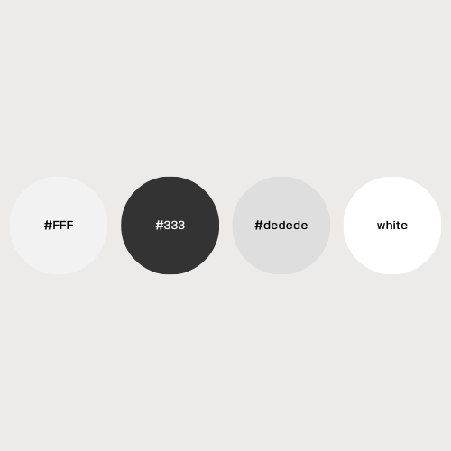

## 👋 자기소개 웹페이지

첫 개발자 교육을 받으며 처음으로 만든 자기소개 포트폴리오 입니다!

 

## 📅 프로젝트 기간
#### 2023.05.10 ~ 2023.06.20

 

## ‍💻 개발환경 / 사용기술
- #### 개발 환경: windows 10
- #### 개발 도구: IntelliJ, Github
- #### 개발 언어: HTML/CSS/JS

 

## ✨ 구현한 기능 소개
아래의 2가지 JavaScript 기능이 있는 <a href="https://www.minbumkim.com/">자기소개</a> 웹페이지입니다.

#### 1. 타이핑 효과
#### 2. 퍼센트바 채우기
#### 2-1. 반응형 퍼센트바 채우기

#### 3. 모달버튼
    

## 🌈 UI 디자인

### 디자인

### 색상

- 이 웹 페이지는 주로 검은색과 흰색을 활용하여 깔끔한 디자인을 구현했습니다.
- 검은색은 고요함과 신뢰감을 상징하여 사용자에게 안정적인 느낌을 전달하고,  흰색은 내용의 가독성을 높이고, 전체적인 디자인을 화사하게 만듭니다.

 

### 🔗 배포 링크
- <a href="https://www.minbumkim.com/">자기소개 웹 페이지</a>
